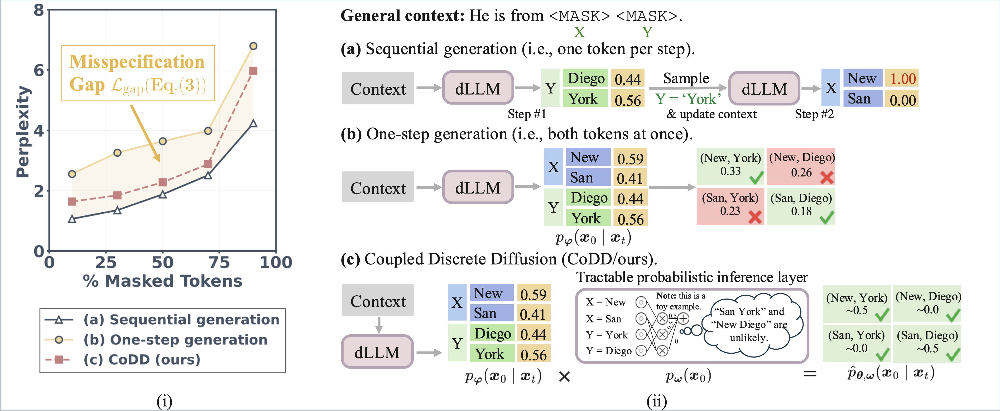

# **Co**upled **D**iscrete **D**iffusion (CoDD)

This is the official demo for the paper **Breaking the Factorization Barrier in Diffusion Language Models**.

<p align="center">
  
  <br>
  
</p>

***Motivation and Intuition of CoDD.*** **Left:** Illustration of the misspecification gap. The plot reports the perplexity of [LLaDA](https://github.com/ML-GSAI/LLaDA) on the MathInstruct validation set across varying mask ratios. Curve **(a)** Sequential generation represents the ideal baseline (i.e., the true joint distribution learned by the model). When restricted to **(b)** One-step generation, the independence assumption causes significant performance degradation. The shaded region highlights this loss of perplexity, defined as the misspecification gap $\mathcal{L}_{\mathrm{gap}}$. **(c)** CoDD significantly bridges this gap while retaining the efficiency of one-step prediction. **Right:** Conceptual comparison on "He is from \<MASK\> \<MASK\>". **(a)** Sequential generation accurately resolves dependencies but sacrifices speed. **(b)** One-step generation predicts in parallel but assumes independence, leading to incoherent mixtures like "San York". **(c)** CoDD overcomes this by modulating predictions with a tractable probabilistic inference layer, recovering valid joint distributions (e.g., "San Diego") in a single parallel step.

## Quick Start

### 1. Install Dependencies

```bash
conda env create -f environment.yml
conda activate codd
```

### 2. Set Up lm-evaluation-harness

Our evaluation uses a customized lm-evaluation-harness. Add it to your Python path:

```bash
export PYTHONPATH="${PYTHONPATH}:$(pwd)/lm-evaluation-harness"
cd lm-eval-harness
pip install -e .
pip install math_verify
cd ..
```
To make this permanent, consider adding the above line to your `~/.bashrc` or `~/.zshrc`.

### 3. Run the Example

```bash
python example.py
```

This script compares on a simple example:
- **Base LLaDA-8B-Instruct**: Standard block diffusion generation
- **CoDD**: Copula-guided block diffusion generation

## Benchmark Evaluation

Use `./eval/eval.sh` to run evaluations on benchmarks (GSM8K, MATH500, MBPP, GPQA).

### Basic Usage

```bash
cd eval
./eval.sh --gpus 0 \
    --run '--model_alias llada --llada_ckpt GSAI-ML/LLaDA-8B-Instruct --task math500 --alg low_confidence --num_steps 256'
```

### With CoDD (PC Guidance)

```bash
./eval.sh --gpus 0 \
    --run '--model_alias llada --llada_ckpt GSAI-ML/LLaDA-8B-Instruct --task math500 --alg low_confidence --num_steps 256 --pc_ckpt il18/llada-math-pc --pc_temperature 0.1 --pc_frac 0.3'
```

### eval.sh Options

| Option | Description |
|--------|-------------|
| `--gpus` | Comma-separated GPU IDs (e.g., `0,1,2`) |
| `--run` | Arguments for a single evaluation run |
| `--output_dir` | Directory for results (default: `results`) |
| `--tag` | Optional tag for log files |

### eval.py Arguments

| Argument | Description |
|----------|-------------|
| `--model_alias` | Model type: `llada` or `dream` |
| `--llada_ckpt` | LLaDA checkpoint path or HuggingFace repo |
| `--dream_ckpt` | Dream checkpoint path or HuggingFace repo |
| `--task` | Benchmark: `gsm8k`, `math500`, `mbpp`, `gpqa` |
| `--alg` | Remasking algorithm: `low_confidence`, `random`, `entropy`, `margin`, `topprob` |
| `--num_steps` | Number of diffusion steps |
| `--pc_ckpt` | Path or HuggingFace repo for PC model |
| `--pc_temperature` | PC guidance temperature (default: 0.7) |
| `--pc_frac` | Fraction of steps using PC guidance (default: 0.3) |
| `--block_length` | Block length for semi-autoregressive generation (default: 32) |

### Multi-Run Example

Run multiple evaluations in parallel across GPUs:

```bash
./eval.sh --gpus 0,1\
    --run '--model_alias llada --llada_ckpt GSAI-ML/LLaDA-8B-Instruct --task gpqa --alg low_confidence --num_steps 256' \
    --run '--model_alias llada --llada_ckpt GSAI-ML/LLaDA-8B-Instruct --task math500 --alg low_confidence --num_steps 256' \
```

Logs are saved to `eval/results/logs/`.

## Acknowledgements
The evaluation scripts in this repository are adapted from [APD](https://github.com/danielmisrael/apd), building upon the [EleutherAI lm-evaluation-harness](https://github.com/EleutherAI/lm-evaluation-harness).
